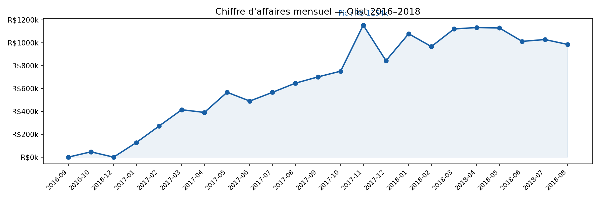
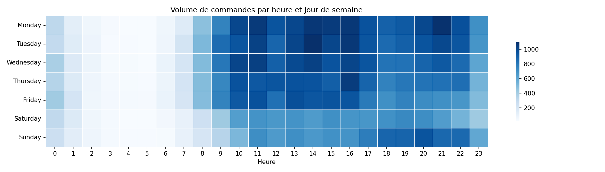
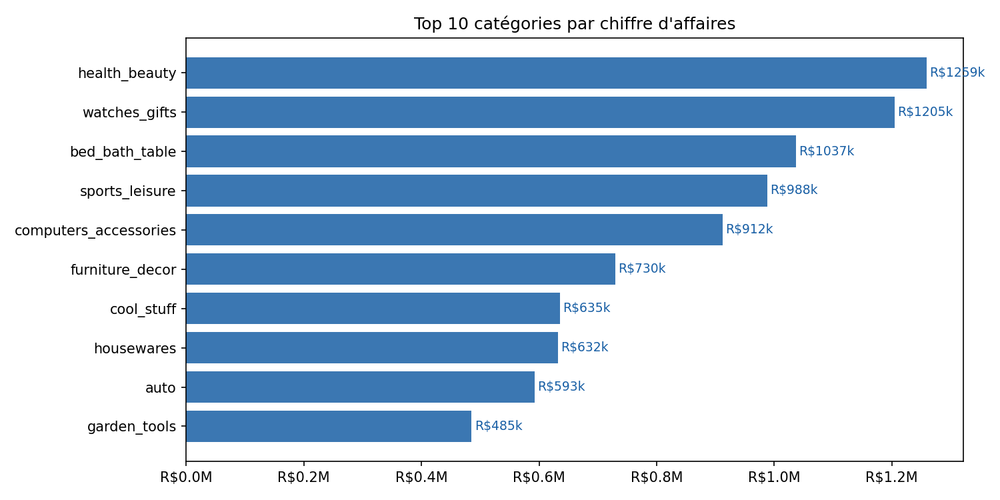

# data-analyst-portfolio
# 📊 Portfolio — Data Analyst | Rabiaa Romdhan

> Parcours intensif vers le niveau professionnel en data analyse.  
> Chaque projet couvre un cycle complet : collecte → nettoyage → analyse → visualisation → insights métier.

---

## 🗂️ Projets

### 1. Dashboard E-Commerce — Olist Brasil
**Contexte :** Analyse des performances d'une marketplace brésilienne (2016–2018) sur 96 478 commandes livrées.

**Insights clés :**
- CA multiplié par ~23 entre sept. 2016 et nov. 2017
- Pic Black Friday nov. 2017 : R$1,2M en un seul mois
- Panier moyen : R$159.86 · Délai moyen de livraison : 12.1 jours
- 4.1% des commandes livrées avec plus de 30 jours de retard
- Top catégorie : `health_beauty` (R$1 259k de CA total)
- Pic de commandes : 20h–21h en semaine

**Stack :** Python · Pandas · Matplotlib · Seaborn · Kaggle Notebooks

**Liens :**
[](https://www.kaggle.com/code/rabiaaromdhan/brazilian-e-commerce)



---

### 2. Analyse A/B Test — Campagne Marketing *(à venir)*
Test d'hypothèse statistique sur un dataset e-commerce réel.  
`scipy.stats` · `p-value` · `Test t` · Recommandation chiffrée

---

### 3. Segmentation Clients RFM *(à venir)*
Scoring Récence / Fréquence / Montant sur le dataset UCI Online Retail.  
`Pandas GroupBy` · `Scoring` · Actions marketing ciblées

---

### 4. Prévision de Ventes — Séries Temporelles *(à venir)*
Décomposition STL + forecasting avec Prophet.  
`statsmodels` · `Prophet` · `RMSE/MAE`

---

### 5. Pipeline de Rapport Automatisé *(à venir)*
Script Python qui génère un rapport HTML hebdomadaire automatiquement.  
`requests` · `Jinja2` · `GitHub Actions` · `Plotly`

---

## 🛠️ Stack technique

| Catégorie | Outils |
|---|---|
| Langages | Python 3.11, SQL |
| Analyse | Pandas, NumPy, SciPy |
| Visualisation | Matplotlib, Seaborn, Plotly |
| Machine Learning | Scikit-learn, XGBoost |
| Deep Learning | PyTorch, Hugging Face |
| MLOps | MLflow, FastAPI, Docker, GitHub Actions |
| BI | Tableau Public, Power BI |
| Cloud | Kaggle, Nutanix (NCA/NCP-MCI en cours) |

---

## 📈 Roadmap d'apprentissage

```
Phase 1 — Fondations maths & Python     ✅ En cours
Phase 2 — Analyse de données avancée   🔄 Projet 1 terminé
Phase 3 — Machine Learning classique    ⏳ À venir
Phase 4 — Deep Learning appliqué        ⏳ À venir
```

---

## 📬 Contact

- **Kaggle :** [rabiaaromdhan](https://www.kaggle.com/rabiaaromdhan)
- **GitHub :** [rromdhan](https://github.com/rromdhan)
